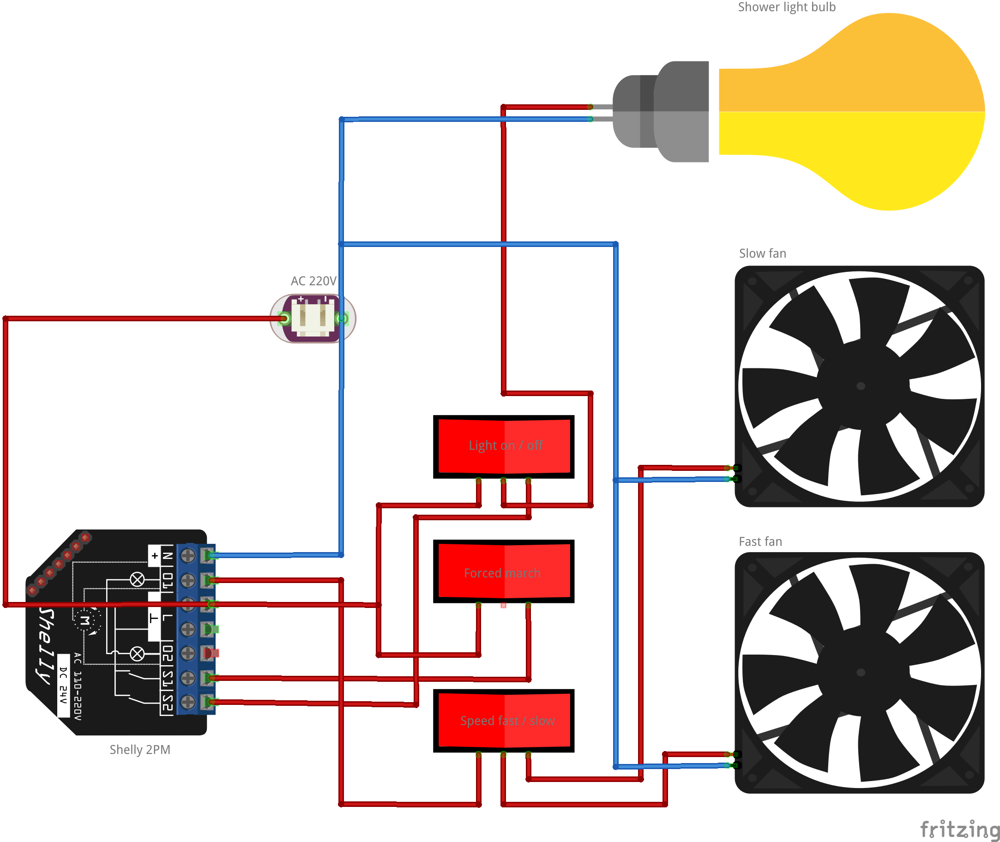

# Shelly 2PM fan automation

## Description
This script automates fan control using a [Shelly 2PM](https://bdc.shelly.cloud/base-de-connaissances/shelly-plus-2pm) device based on the switch state. It includes a timer mechanism that automatically turns off the fan after a defined duration.

## Features
- Automatic fan activation when the light switch is turned on.
- Timer-based automatic fan shutdown after a preset duration.
- **Forced Mode**: Keeps the fan running continuously, regardless of the light switch state, for extended ventilation.

## Requirements
- **Shelly 2PM** device
- 3 **rocker switches** with 2 positions

## Installation
1. Make the connections according to the following schematic to properly connect your Shelly 2PM device.

2. Enable scripting on your Shelly device.
3. Upload the script *shelly-2b-fan-control.js* to the **Shelly Script Editor**.
4. Adjust the `NUM_OF_MINUTES` variable to define the fan shutdown delay.
5. Save and run the script.

## Configuration

### Shelly 2PM Setup

- **Configuration in the app for each input/output pair:**
  - Select the input button/switch mode: **Switch**
  - Set the relay type: **Configure the Shelly device to be in "autonomous" switch mode**
  - Set the default relay power-up behavior:
    - **IO1:** Configure the Shelly device to restore the last mode it was in when powered on.
    - **IO2:** Configure the Shelly device to turn off when powered on.
  - Uncheck **"Factory Reset Activation from Input": IO1 and IO2.**

- **Factory reset by input** is a way to restore the device's factory settings and undo any changes made. This action is only possible within the first 60 seconds after boot. The user should toggle the input 5 times, and the device will reset to its factory settings. A factory reset can also be done using an RPC call.

- **Scripts:**
  - Check **"Run on startup"**

### Light switch:
When the switch is closed, the light and the ventilation system (VMC) turn on. When the switch is open, the light turns off, but the ventilation remains active for 30 minutes.

### Speed selector:
- When positioned upwards, the slowest (quietest) speed is selected. Use this position for air circulation during the day.
- When positioned downwards, the fast speed is selected. Use the fast speed for showers or to eliminate kitchen odors.

### Forced Mode:
In cases where extended use of the VMC is necessary (e.g., kitchen, high humidity to be ventilated), activate by positioning the switch downwards. For nighttime use, position the switch upwards.

## Usage
- The fan turns on automatically when the light switch is activated.
- If the light is turned off, the fan will continue running for the predefined duration before shutting down.
- If the Forced Mode switch is manually turned off, the fan will still run for the predefined duration before shutting down.
- When the Forced Mode switch is turned on, the fan will continue running regardless of the light switch state.
